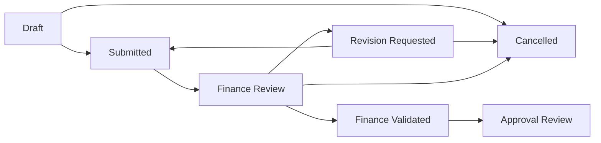

# Aplikasi Pencatatan Keuangan Kantor KDKMP

Aplikasi ini digunakan untuk mengelola data wilayah, koperasi, PIC KDKMP, rekening user, pengajuan dana, review finance staff, revisi pengajuan, dan antrean approval keuangan.

## Tech Stack

- PHP 8.4
- Laravel 13
- PostgreSQL untuk database utama
- Inertia.js
- React 19
- TypeScript
- Vite 8
- Tailwind CSS 4
- shadcn/ui + Radix UI
- Sonner untuk toast notification
- Spatie Laravel Permission untuk role dan permission
- Laravel Fortify untuk auth
- Pest untuk testing
- Laravel Pint untuk formatting PHP

## Role Utama

- `super_admin`: mengelola user, role, master data, koperasi, wilayah, dan akses penuh.
- `pic_kdkmp`: membuat dan merevisi pengajuan dana untuk koperasi yang diassign.
- `finance_staff`: melakukan review pengajuan, request revisi, menolak, atau mengajukan ke approval.
- `finance_approver`: melihat antrean pengajuan yang sudah dinaikkan ke approval.
- `finance_director`: role disiapkan untuk fase approval lanjutan.

## Fitur Aplikasi

- Manajemen user dan role.
- User PIC memiliki area kota/kabupaten dari tabel `cities`.
- Manajemen wilayah provinsi, kota/kabupaten, kecamatan, dan desa.
- Import data wilayah.
- Manajemen koperasi dan assignment PIC berdasarkan area.
- Import data koperasi dari Excel.
- Manajemen rekening user.
- Master kategori pengajuan.
- Master jenis pengajuan.
- Pengajuan dana mobile-first.
- Upload attachment bukti/rincian penggunaan dana.
- Preview attachment gambar di detail pengajuan.
- Review pengajuan oleh finance staff.
- Request revisi ke PIC.
- Resubmit pengajuan setelah revisi.
- Penolakan pengajuan oleh finance staff.
- Forward pengajuan ke finance approval.
- Notifikasi database untuk pengajuan baru, revisi, resubmit, dan forward approval.
- Audit log.
- Sonner toast untuk success, warning, dan error.

## Alur Data Master

### Wilayah

Wilayah berjenjang:

1. Provinsi
2. Kota/Kabupaten
3. Kecamatan
4. Desa

Koperasi terhubung ke wilayah sampai level desa.

### User PIC dan Area

Saat membuat user PIC, admin memilih area kota/kabupaten dari tabel `cities`.

Saat assign PIC ke koperasi, daftar PIC difilter berdasarkan kota/kabupaten koperasi. Backend juga memvalidasi agar PIC tidak bisa diassign ke koperasi di luar area.

### Rekening User

Setiap user dapat memiliki lebih dari satu rekening:

- Nama bank
- Nomor rekening
- Nama pada rekening
- Status aktif
- Rekening utama

Rekening dipilih saat membuat pengajuan dana sehingga PIC tidak perlu mengisi rekening manual.

## Alur Pengajuan Dana

Satu pengajuan dana adalah satu record utama di `financial_submissions`.

`submission_items` tetap ada sebagai detail internal satu baris untuk kompatibilitas kalkulasi dan workflow lama. User tidak mengisi banyak item.

Data yang dicatat pada pengajuan:

- User yang mengajukan
- Area user yang mengajukan
- Koperasi yang mengajukan
- Title pengajuan
- Kategori pengajuan
- Jenis pengajuan
- Nominal pengajuan
- Tanggal dibutuhkan
- Tanggal diajukan dari `created_at`
- Catatan opsional
- Rekening penerima
- Attachment bukti/rincian penggunaan dana

Kategori default:

- Pengajuan Dana KDKMP
- Operasional tim Sales
- Pengajuan Reimbursement

Untuk PIC KDKMP, kategori Operasional tim Sales disembunyikan dan diblok di backend.

Jenis default:

- Sewa Kendaraan
- Biaya Ongkir
- ATK dan Fotocopy
- Sarana Prasarana

## Alur Status Pengajuan



## Alur PIC KDKMP

1. PIC membuka menu Pengajuan Dana.
2. PIC memilih kategori besar.
3. PIC mengisi title, koperasi, jenis pengajuan, nominal, tanggal dibutuhkan, rekening penerima, dan catatan.
4. PIC menyimpan draft.
5. PIC upload attachment bila diperlukan.
6. PIC submit pengajuan.
7. Jika finance staff meminta revisi, PIC membuka halaman revisi.
8. PIC memperbaiki data dan resubmit.

## Alur Finance Staff

1. Finance staff membuka menu Pengajuan Masuk.
2. Untuk pengajuan `submitted`, staff klik Mulai Review.
3. Status menjadi `finance_review`.
4. Staff membuka detail pengajuan dalam bentuk form review/edit.
5. Staff dapat mengubah data recorded seperti title, kategori, jenis, nominal, tanggal dibutuhkan, catatan PIC, dan catatan staff keuangan.
6. Saat menyimpan review, sistem mencatat:
   - catatan staff keuangan
   - datetime direview
   - nominal review
7. Staff memilih aksi:
   - Cancel: kembali ke list
   - Ajukan ke Approval: pengajuan naik ke approval
   - Request Revisi: wajib isi catatan revisi
   - Tolak Pengajuan: wajib isi alasan penolakan dan status menjadi cancelled

## Alur Finance Approval

Finance approver melihat pengajuan yang sudah masuk status `approval_review`.

Pada fase saat ini, halaman approval bersifat read-only untuk melihat detail pengajuan, attachment, review finance staff, dan timeline status.

## Struktur Penting

- `app/Enums`: enum status, tipe, dan value domain.
- `app/Http/Controllers`: controller Laravel.
- `app/Http/Requests`: validasi request.
- `app/Models`: model Eloquent.
- `app/Policies`: policy akses model.
- `app/Services`: logika bisnis.
- `app/Notifications`: notifikasi database.
- `database/migrations`: schema database.
- `database/seeders`: role, permission, dan data master.
- `resources/js/pages`: halaman Inertia React.
- `resources/js/components`: reusable component.
- `resources/js/components/ui`: shadcn/ui component.
- `tests/Feature`: feature tests.
- `docs`: dokumentasi fase/fitur.

## Setup Lokal

Install dependency:

```bash
composer install
npm install
```

Siapkan environment:

```bash
cp .env.example .env
php artisan key:generate
```

Jalankan migration dan seeder:

```bash
php artisan migrate --seed
```

Jalankan aplikasi:

```bash
php artisan serve
npm run dev
```

## Quality Check

```bash
./vendor/bin/pint
npm run types:check
env DB_CONNECTION=sqlite DB_DATABASE=:memory: php artisan test
npm run build
```

## Catatan Testing

Pada project ini wrapper `php artisan test` dapat mengembalikan exit code `1` walaupun JSON output menyatakan semua test passed. Perhatikan field JSON seperti:

```json
{"result":"passed","tests":55,"passed":55}
```
