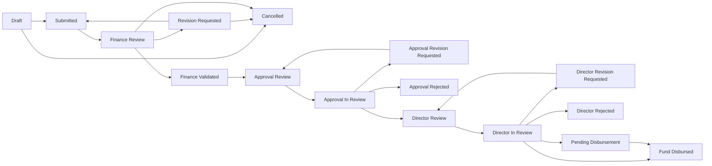

# Aplikasi Pencatatan Keuangan Kantor KDKMP

Aplikasi ini digunakan untuk mengelola data wilayah, koperasi, PIC KDKMP, rekening, pengajuan dan approval dana, pencairan, distribusi, konfirmasi penerimaan, serta pertanggungjawaban penggunaan dana.

## Tech Stack

- PHP 8.4
- Laravel 13
- PostgreSQL untuk database utama
- Inertia.js
- React 19
- TypeScript
- Vite 8
- Tailwind CSS 4
- shadcn/ui + Radix UI
- Sonner untuk toast notification
- Spatie Laravel Permission untuk role dan permission
- Laravel Fortify untuk auth
- Pest untuk testing
- Laravel Pint untuk formatting PHP

## Role Utama

- `super_admin`: mengelola user, role, master data, koperasi, wilayah, dan akses penuh.
- `pic_kdkmp`: membuat dan merevisi pengajuan dana untuk koperasi yang diassign.
- `finance_staff`: melakukan review pengajuan, request revisi, menolak, atau mengajukan ke approval.
- `finance_approver`: review approval, approve/reject, meminta revisi, dan menangani revisi dari Finance Director.
- `finance_director`: review akhir, approve, pencairan dana, reject, revisi ke Finance Approver, dan monitoring Director.

## Fitur Aplikasi

- Manajemen user dan role.
- Manajemen PIC KDKMP terpisah dengan filter, pagination, CRUD, dan bulk assignment koperasi per wilayah.
- User PIC memiliki area kota/kabupaten dari tabel `cities`.
- Manajemen wilayah provinsi, kota/kabupaten, kecamatan, dan desa.
- Import data wilayah.
- Manajemen koperasi dan assignment PIC berdasarkan area.
- Import data koperasi dari Excel.
- Manajemen rekening user.
- Master kategori pengajuan.
- Master jenis pengajuan.
- Pengajuan dana mobile-first.
- Upload attachment bukti/rincian penggunaan dana.
- Preview attachment gambar di detail pengajuan.
- Review pengajuan oleh finance staff.
- Request revisi ke PIC.
- Resubmit pengajuan setelah revisi.
- Penolakan pengajuan oleh finance staff.
- Forward pengajuan ke finance approval.
- Review dan keputusan Finance Approval.
- Review akhir Finance Director.
- Approve Director dengan opsi bayar nanti.
- Approve Director sekaligus kirim dana.
- Pencairan lanjutan untuk pengajuan yang sudah approved.
- Upload dan download bukti transfer pencairan.
- Revisi dari Director ke Finance Approver.
- Dashboard monitoring Finance Director.
- Notifikasi database untuk pengajuan baru, revisi, resubmit, dan forward approval.
- Audit log.
- Sonner toast untuk success, warning, dan error.
- Master rekening perusahaan dan koperasi.
- Pencairan dengan snapshot rekening sumber dan tujuan.
- Distribusi dana oleh Finance Staff.
- Konfirmasi penerimaan dana oleh PIC.
- Laporan realisasi dan pertanggungjawaban dana.
- Review accountability oleh Finance Staff dan approval penutupan oleh Finance Approver.
- Monitoring KPI dan timeline perjalanan dana.
- Sidebar berkelompok berdasarkan permission.
- Reimbursement multi-transaksi dengan bukti pembelian dan bukti pembayaran terpisah.
- Reimbursement otomatis dari kekurangan pertanggungjawaban.
- Pengembalian sisa dana ke rekening perusahaan dengan review Finance dan Approval.
- Penutupan accountability berbasis penyelesaian sisa atau kekurangan dana.
- Export seluruh pengajuan ke XLSX dengan sheet attachment dan URL download private.

## Alur Data Master

### Wilayah

Wilayah berjenjang:

1. Provinsi
2. Kota/Kabupaten
3. Kecamatan
4. Desa

Koperasi terhubung ke wilayah sampai level desa.

### User PIC dan Area

Saat membuat user PIC, admin memilih area kota/kabupaten dari tabel `cities`.

Saat assign PIC ke koperasi, daftar PIC difilter berdasarkan kota/kabupaten koperasi. Backend juga memvalidasi agar PIC tidak bisa diassign ke koperasi di luar area.

Menu `PIC KDKMP` dapat diakses Super Admin, Finance Staff, dan Finance Approver. Halaman assignment menampilkan koperasi pada kota/kabupaten PIC dan mendukung checklist serta check-all per halaman. Penyimpanan hanya menyinkronkan koperasi pada halaman aktif agar pilihan di halaman pagination lain tidak terhapus.

## Export Pengajuan

Super Admin, Finance Staff, dan Finance Approver dapat mengunduh seluruh pengajuan melalui tombol `Export Semua Pengajuan` pada halaman Pengajuan Dana, Pengajuan Masuk, atau Finance Approval.

Workbook memiliki dua sheet:

1. `Pengajuan`: data utama dan status workflow seluruh pengajuan.
2. `Attachments`: daftar attachment, metadata file, dan URL download terautentikasi.

Export ditulis secara streaming dan data dibaca per chunk untuk menjaga penggunaan memori ketika jumlah pengajuan besar.

### Rekening User

Setiap user dapat memiliki lebih dari satu rekening:

- Nama bank
- Nomor rekening
- Nama pada rekening
- Status aktif
- Rekening utama

Rekening dipilih saat membuat pengajuan dana sehingga PIC tidak perlu mengisi rekening manual.

## Alur Pengajuan Dana

Satu pengajuan dana adalah satu record utama di `financial_submissions`.

`submission_items` tetap ada sebagai detail internal satu baris untuk kompatibilitas kalkulasi dan workflow lama. User tidak mengisi banyak item.

Data yang dicatat pada pengajuan:

- User yang mengajukan
- Area user yang mengajukan
- Koperasi yang mengajukan
- Title pengajuan
- Kategori pengajuan
- Jenis pengajuan
- Nominal pengajuan
- Tanggal dibutuhkan
- Tanggal diajukan dari `created_at`
- Catatan opsional
- Rekening penerima
- Attachment bukti/rincian penggunaan dana

Kategori default:

- Pengajuan Dana KDKMP
- Operasional tim Sales
- Pengajuan Reimbursement

Untuk PIC KDKMP, kategori Operasional tim Sales disembunyikan dan diblok di backend.

Jenis default:

- Sewa Kendaraan
- Biaya Ongkir
- ATK dan Fotocopy
- Sarana Prasarana

## Alur Status Pengajuan



## Alur PIC KDKMP

1. PIC membuka menu Pengajuan Dana.
2. PIC memilih kategori besar.
3. PIC mengisi title, koperasi, jenis pengajuan, nominal, tanggal dibutuhkan, rekening penerima, dan catatan.
4. PIC menyimpan draft.
5. PIC upload attachment bila diperlukan.
6. PIC submit pengajuan.
7. Jika finance staff meminta revisi, PIC membuka halaman revisi.
8. PIC memperbaiki data dan resubmit.

## Alur Finance Staff

1. Finance staff membuka menu Pengajuan Masuk.
2. Untuk pengajuan `submitted`, staff klik Mulai Review.
3. Status menjadi `finance_review`.
4. Staff membuka detail pengajuan dalam bentuk form review/edit.
5. Staff dapat mengubah data recorded seperti title, kategori, jenis, nominal, tanggal dibutuhkan, catatan PIC, dan catatan staff keuangan.
6. Saat menyimpan review, sistem mencatat:
   - catatan staff keuangan
   - datetime direview
   - nominal review
7. Staff memilih aksi:
   - Cancel: kembali ke list
   - Ajukan ke Approval: pengajuan naik ke approval
   - Request Revisi: wajib isi catatan revisi
   - Tolak Pengajuan: wajib isi alasan penolakan dan status menjadi cancelled

## Alur Finance Approval

Finance approver melihat pengajuan yang sudah masuk status `approval_review`.

Finance approver dapat mulai review, menyetujui ke Finance Director, menolak, atau meminta revisi ke Finance Staff. Jika Finance Director meminta revisi, Finance Approver menerima menu Revisi Director dan dapat resubmit ke Director.

## Alur Finance Director

1. Finance Director membuka Queue Director.
2. Untuk pengajuan `director_review`, Director klik Mulai Review.
3. Status menjadi `director_in_review`.
4. Director dapat:
   - Setujui - Bayar Nanti: status menjadi `pending_disbursement`.
   - Setujui dan Kirim Dana: upload bukti transfer dan status menjadi `fund_disbursed`.
   - Kirim Dana untuk pengajuan `pending_disbursement`.
   - Minta Revisi ke Finance Approver.
   - Tolak pengajuan dengan status final `director_rejected`.
5. Pencairan mencatat nomor `DISB/YYYY/MM/000001`, snapshot rekening tujuan, metode pembayaran, referensi transaksi, dan attachment bukti transfer private.

## Alur Perjalanan Dana

1. Finance Director memilih rekening perusahaan, jenis penerima pertama, rekening tujuan, dan mengunggah bukti transfer.
2. Jika penerima pertama Finance Staff, staff mencatat satu atau beberapa distribusi sampai nominal pencairan tersalurkan.
3. PIC mengonfirmasi dana yang diterima langsung dari Director atau melalui Finance Staff.
4. PIC membuat laporan penggunaan dana berisi item realisasi dan bukti.
5. Finance Staff memverifikasi laporan atau meminta revisi.
6. Finance Approver menyetujui dan menutup pertanggungjawaban.
7. Finance Director dan role monitoring melihat status lengkap melalui Monitoring Dana.

Dokumentasi rinci tersedia di [docs/phase-6-fund-accountability.md](docs/phase-6-fund-accountability.md).

Dokumentasi Phase 7 tersedia di [docs/phase-7-reimbursement-and-fund-return.md](docs/phase-7-reimbursement-and-fund-return.md).

## Alur Uang Panjar

Finance Staff dapat membuat uang panjar dari dialog pengajuan yang sama. Pengajuan melewati review Finance Staff lain, Finance Approval, Director, dan pencairan existing. Setelah dicairkan, penanggung jawab membuat settlement per transaksi dengan bukti pembelian dan pembayaran. Selisih realisasi otomatis diarahkan ke pengembalian sisa dana atau reimbursement sebelum panjar ditutup.

Dokumentasi Phase 8 tersedia di [docs/phase-8-advances.md](docs/phase-8-advances.md).

## Struktur Penting

- `app/Enums`: enum status, tipe, dan value domain.
- `app/Http/Controllers`: controller Laravel.
- `app/Http/Requests`: validasi request.
- `app/Models`: model Eloquent.
- `app/Policies`: policy akses model.
- `app/Services`: logika bisnis.
- `app/Notifications`: notifikasi database.
- `database/migrations`: schema database.
- `database/seeders`: role, permission, dan data master.
- `resources/js/pages`: halaman Inertia React.
- `resources/js/components`: reusable component.
- `resources/js/components/ui`: shadcn/ui component.
- `tests/Feature`: feature tests.
- `docs`: dokumentasi fase/fitur.

## Setup Lokal

Install dependency:

```bash
composer install
npm install
```

Siapkan environment:

```bash
cp .env.example .env
php artisan key:generate
```

Jalankan migration dan seeder:

```bash
php artisan migrate --seed
```

Jalankan aplikasi:

```bash
php artisan serve
npm run dev
```

## Quality Check

```bash
./vendor/bin/pint
npm run types:check
env DB_CONNECTION=sqlite DB_DATABASE=:memory: php artisan test
npm run build
```

## Catatan Testing

Pada project ini wrapper `php artisan test` dapat mengembalikan exit code `1` walaupun JSON output menyatakan semua test passed. Perhatikan field JSON seperti:

```json
{"result":"passed","tests":55,"passed":55}
```
