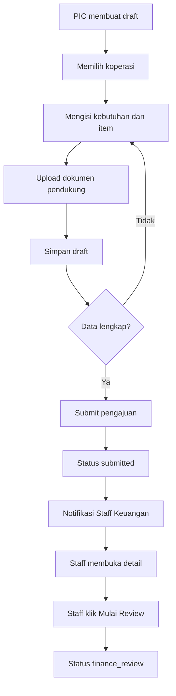

# Phase 2 Fund Submission

Phase 2 menambahkan alur pengajuan dana PIC KDKMP sampai antrean Staff Keuangan. Nomor pengajuan final dibuat saat draft pertama dibuat dengan format `FR/YYYY/MM/000001` melalui `DocumentNumberService` dan tabel `document_sequences`.

Status aktif Phase 2: `draft`, `submitted`, `finance_review`, `cancelled`. Enum juga menyiapkan `revision_requested`, tetapi flow revisi ditunda ke Phase 3.

Permission baru ditambahkan di `RolePermissionSeeder`; kategori awal ada di `SubmissionCategorySeeder`. Attachment disimpan private pada disk `FINANCE_ATTACHMENT_DISK` dengan default `local`, maksimal 10 MB dan 10 file per pengajuan.

Route utama: `/submissions`, `/finance/submissions`, `/notifications`, dan endpoint download attachment terotorisasi. Service utama: `SubmissionService`, `SubmissionItemService`, `SubmissionAttachmentService`, `SubmissionStatusService`, `SubmissionCalculator`, dan `DocumentNumberService`.

Batasan Phase 2: belum ada approval, revisi, pencairan, reimbursement, uang panjar, settlement, export laporan, email, atau WhatsApp notification.
