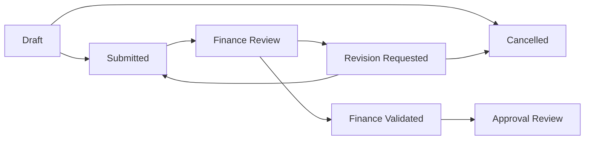

# Phase 3 - Finance Validation

Phase 3 menambahkan lapisan validasi finance setelah pengajuan masuk dari PIC KDKMP dan sebelum antrean approval keuangan.

## Alur Status

## Permission Baru

- `finance-submissions.update`
- `finance-submissions.request-revision`
- `finance-submissions.validate`
- `finance-submissions.forward-approval`
- `approval-submissions.view`
- `submissions.revise`
- `submissions.resubmit`

## Data Baru

- `financial_submissions`: reviewer finance, validator finance, timestamp validasi, forwarder approval, counter revisi, dan timestamp revisi/resubmit.
- `finance_submission_details`: detail akun anggaran, cost center, metode pembayaran, beneficiary, pajak, catatan finance, dan nominal tervalidasi.
- `submission_revision_requests`: permintaan revisi dari finance ke PIC. Hanya satu revisi `open` per pengajuan.
- `submission_revision_responses`: balasan PIC ketika pengajuan dikirim ulang.

## Endpoint Utama

- `PUT /finance/submissions/{financialSubmission}/finance-detail`
- `POST /finance/submissions/{financialSubmission}/request-revision`
- `POST /finance/submissions/{financialSubmission}/validate`
- `POST /finance/submissions/{financialSubmission}/forward-approval`
- `GET /submissions/{financialSubmission}/revision`
- `PUT /submissions/{financialSubmission}/revision`
- `POST /submissions/{financialSubmission}/resubmit`
- `GET /approval/submissions`
- `GET /approval/submissions/{financialSubmission}`
