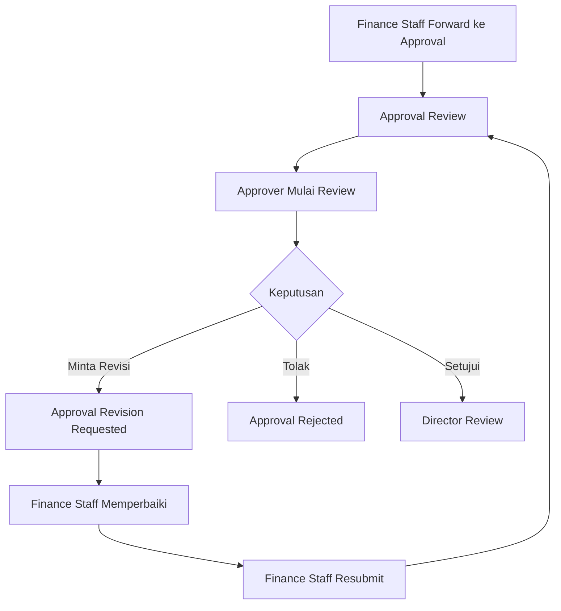
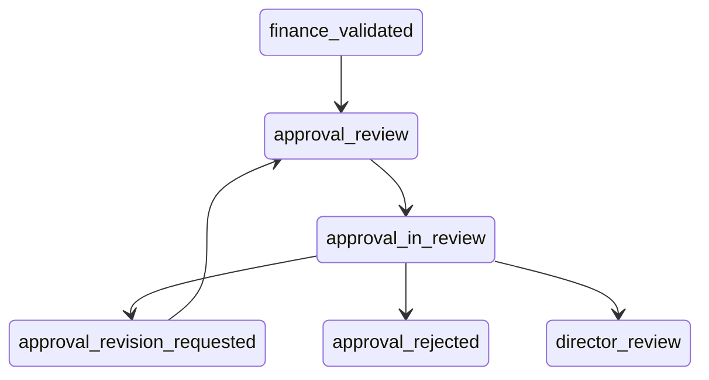

# Phase 4 - Finance Approval dan Dashboard Monitoring

Phase 4 menyelesaikan workflow Finance Approval dan menambahkan dashboard monitoring ringkas untuk Finance Staff, Finance Approver, Finance Director, dan Super Admin.

## Ringkasan

Finance Approver sekarang dapat memulai review, menyetujui, menolak, atau meminta revisi kepada Finance Staff. Approval yang disetujui langsung masuk antrean Finance Director dengan status `director_review`.

Finance Director pada Phase 4 hanya memiliki queue dan detail read-only.

## Workflow

## Status Baru

- `approval_in_review`
- `approval_revision_requested`
- `approval_rejected`
- `director_review`

Status `approval_review` sudah ada dari Phase 3.

## Allowed Transitions

- `finance_validated -> approval_review`
- `approval_review -> approval_in_review`
- `approval_in_review -> approval_revision_requested`
- `approval_revision_requested -> approval_review`
- `approval_in_review -> approval_rejected`
- `approval_in_review -> director_review`

Semua transisi tetap melalui `SubmissionStatusService`.

## Permission Baru

- `approval-submissions.review`
- `approval-submissions.approve`
- `approval-submissions.reject`
- `approval-submissions.request-revision`
- `finance-submissions.view-approval-revision`
- `finance-submissions.update-approval-revision`
- `finance-submissions.resubmit-approval`
- `director-submissions.view`
- `finance-monitoring.view`
- `approval-monitoring.view`
- `global-monitoring.view`

Super Admin mendapat seluruh permission.

## Struktur Approval Review

Tabel `submission_approval_reviews` menyimpan histori setiap siklus approval:

- submission
- approver
- review number
- status review
- decision
- submitted amount
- approved amount
- notes
- rejection reason
- revision subject/message/fields
- started/decided/resolved timestamp

Satu pengajuan dapat memiliki banyak approval review karena revisi approval dapat berulang.

## Flow Start Review

Approver menekan `Mulai Review` pada status `approval_review`.

Sistem mengisi:

- `approval_reviewed_by`
- `approval_review_started_at`
- active approval review menjadi `in_review`
- status submission menjadi `approval_in_review`

Double start ditolak oleh status dan ownership review.

## Flow Approve

Approver mengisi:

- nominal disetujui
- catatan approval

Aturan:

- approved amount tidak boleh lebih besar dari submitted amount review finance
- jika approved amount lebih kecil, catatan wajib

Saat approve:

- review decision menjadi `approved`
- `approval_approved_amount` terisi
- submission menjadi `director_review`
- assignee menjadi `finance_director`
- notifikasi dikirim ke PIC, Finance Staff terkait, dan Finance Director

## Flow Reject

Approver wajib mengisi alasan penolakan minimal 10 karakter.

Saat reject:

- review decision menjadi `rejected`
- submission menjadi `approval_rejected`
- rejection dianggap final pada Phase 4
- PIC dan Finance Staff terkait mendapat notifikasi

## Flow Request Revision

Approver meminta revisi kepada Finance Staff, bukan langsung ke PIC.

Data yang disimpan:

- subject revisi
- pesan revisi
- fields yang perlu diperbaiki
- notes opsional

Status menjadi `approval_revision_requested` dan assignee kembali ke `finance_staff`.

## Flow Perbaikan Finance Staff

Finance Staff membuka menu `Revisi Approval`, melihat pesan approver, memperbaiki recorded submission/finance review, lalu dapat:

- Simpan Perbaikan: status tetap `approval_revision_requested`
- Kirim Ulang ke Approval: review lama menjadi `superseded`, review baru dibuat sebagai `pending`, status kembali `approval_review`

Jika revisi membutuhkan data PIC, Finance Staff tetap memakai flow revisi PIC dari Phase 3.

## Flow Finance Director

Pengajuan approved masuk ke `director_review`.

Director dapat melihat:

- data PIC dan koperasi
- data pengajuan
- nominal approval
- approver
- attachment
- timeline

Director belum dapat approve, reject, request revision, atau pencairan dana.

## Dashboard dan KPI

Dashboard Phase 4 dibuat berbasis aggregate query database:

- Finance Monitoring
- Approval Monitoring
- Global Monitoring

KPI yang tersedia:

- jumlah pengajuan per status utama
- nominal aktif/pending/approved
- overdue
- queue perlu tindakan
- breakdown status global

Chart library belum ditambahkan karena project belum memiliki dependency chart dan Phase 4 menjaga dependency tetap ringan.

## Notification

Notification database baru:

- `ApprovalRevisionRequestedNotification`
- `ApprovalResubmittedNotification`
- `SubmissionApprovedByFinanceApproverNotification`
- `SubmissionRejectedByFinanceApproverNotification`
- `SubmissionForwardedToDirectorNotification`

Notification dikirim dengan `DB::afterCommit()`.

## Audit Log

Event approval dicatat:

- `approval.review_started`
- `approval.approved`
- `approval.rejected`
- `approval.revision_requested`
- `approval.revision_updated`
- `approval.resubmitted`

Metadata menyimpan id submission, nomor submission, review id, review number, amount, dan decision.

## Data Visibility

- PIC melihat status dan keputusan final pada pengajuannya sendiri.
- Finance Staff melihat revisi approval dan keputusan yang relevan.
- Finance Approver melihat detail approval, attachment, finance notes, dan rekening snapshot.
- Finance Director hanya melihat submission `director_review`.
- Super Admin dapat monitoring global.

## Concurrency dan Idempotency

Idempotency minimal dijaga dengan:

- status transition terpusat
- row lock `lockForUpdate`
- active approval review lock
- status ownership approver saat `in_review`

Double approve/reject/revision/resubmit akan ditolak setelah status berubah.

## Route Baru

- `POST /approval/submissions/{financialSubmission}/start-review`
- `POST /approval/submissions/{financialSubmission}/approve`
- `POST /approval/submissions/{financialSubmission}/reject`
- `POST /approval/submissions/{financialSubmission}/request-revision`
- `GET /finance/approval-revisions`
- `GET /finance/approval-revisions/{financialSubmission}`
- `PUT /finance/approval-revisions/{financialSubmission}`
- `POST /finance/approval-revisions/{financialSubmission}/resubmit`
- `GET /director/submissions`
- `GET /director/submissions/{financialSubmission}`
- `GET /monitoring/finance`
- `GET /monitoring/approval`
- `GET /monitoring/global`

## Service

- `App\Services\Approval\FinanceApprovalService`
- `App\Services\FinanceSubmission\FinanceSubmissionService` diperluas untuk perbaikan approval revision
- `App\Services\Submission\SubmissionStatusService` diperluas untuk transisi Phase 4

## Testing

Test Phase 4 berada di:

- `tests/Feature/Phase4FinanceApprovalTest.php`

Coverage utama:

- forward finance membuat approval review pending
- start review dan approve ke director
- request revision dan resubmit
- reject final ke `approval_rejected`

## Batasan Phase 4

Belum diimplementasikan:

- Finance Director approve/reject/request revision
- pencairan dana
- bukti transfer
- payment status
- reimbursement workflow khusus
- uang panjar
- settlement
- integrasi bank
- jurnal akuntansi
- export laporan final
- email/WhatsApp notification

## Technical Debt Phase 5

- Tambah chart library bila dashboard visual benar-benar dibutuhkan.
- Tambah cache TTL dashboard setelah volume data besar.
- Tambah policy resource khusus approval review bila kebutuhan akses makin granular.
- Tambah partial unique index PostgreSQL untuk active approval review jika environment migration PostgreSQL sudah distandardisasi.
