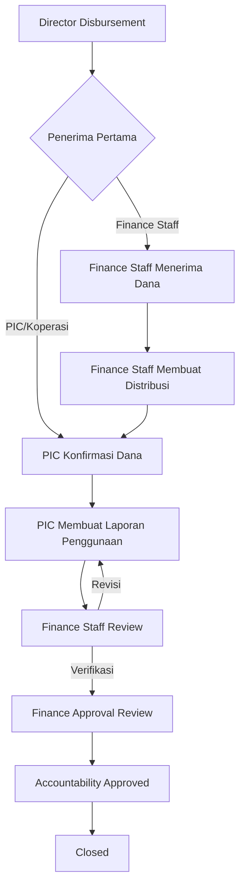
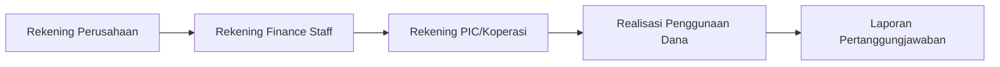

# Phase 6 - Fund Allocation, Distribution Tracking, dan Pertanggungjawaban Dana

Phase 6 memisahkan dokumen pengajuan, pencairan Director, distribusi Finance Staff, konfirmasi penerimaan PIC, dan laporan pertanggungjawaban ke domain tersendiri. Status utama pengajuan tetap memakai workflow Phase 1-5, sedangkan perjalanan dana memakai `submission_disbursements.distribution_status` dan `fund_accountability_reports.status`.

## 6.1 Disbursement Enhancement

- Master `company_bank_accounts` menjadi sumber rekening pencairan dan dikelola Super Admin atau Finance Director.
- Master `cooperative_bank_accounts` menyimpan rekening aktif koperasi.
- Pencairan memilih jenis penerima: `finance_staff`, `pic_kdkmp`, `cooperative`, atau `other`.
- Backend memvalidasi kepemilikan rekening dan mengambil snapshot sumber/tujuan dari master.
- Transfer ke Finance Staff menghasilkan `requires_distribution = true` dan status `pending`.
- Transfer langsung ke PIC/koperasi menghasilkan `requires_distribution = false` dan status `not_required`.
- Notifikasi pencairan dikirim setelah commit dan nomor rekening selalu dimasking.

## 6.2 Fund Distribution

- Finance Staff yang menjadi penerima pertama dapat membuat satu atau beberapa distribusi.
- Pembuatan mengunci record pencairan dengan `lockForUpdate`.
- Setiap form membawa idempotency key unik agar retry request tidak membuat distribusi ganda.
- Nominal dihitung dalam satuan sen dan total distribusi aktif tidak boleh melebihi pencairan.
- Nomor distribusi memakai format `DIST/YYYY/MM/000001` melalui sequence yang concurrency-safe.
- Bukti transfer disimpan di disk private, maksimal lima file berukuran 10 MB.
- Status berubah menjadi `partially_distributed` atau `fully_distributed` berdasarkan total distribusi.

## 6.3 Receipt Confirmation

- PIC dapat mengonfirmasi pencairan langsung atau distribusi Finance Staff untuk pengajuannya.
- Satu konfirmasi hanya mempunyai satu sumber: disbursement atau distribution.
- Unique constraint dan row locking mencegah konfirmasi ganda.
- Setelah konfirmasi, perjalanan dana masuk ke `accountability_pending`.

## 6.4 Accountability

- Satu pengajuan hanya dapat mempunyai satu laporan pertanggungjawaban.
- `received_amount` berasal dari total konfirmasi penerimaan, bukan input frontend.
- PIC mencatat banyak item realisasi dan bukti report-level.
- Backend menghitung ulang `realized_amount`, `remaining_amount`, dan `additional_amount`.
- Alur laporan: `draft -> submitted -> finance_review -> finance_verified -> closed`.
- Finance Staff dapat meminta revisi sehingga status menjadi `revision_requested`.
- Finance Approver menyetujui laporan terverifikasi dan menutup pertanggungjawaban.

## 6.5 Monitoring

- `FundMonitoringService` menggunakan query agregasi database untuk total pencairan, distribusi, konfirmasi, realisasi, sisa, kekurangan, dan KPI rate.
- Filter tersedia untuk tanggal, provinsi, kota/kabupaten, koperasi, PIC, Finance Staff, Finance Approver, Director, kategori, jenis pengajuan, jenis penerima, status distribusi, dan status accountability.
- Rata-rata waktu distribusi dan pengiriman accountability dihitung dengan agregasi timestamp di PostgreSQL/SQLite, bukan collection di memory.
- `FundJourneyTimeline` menampilkan urutan approval Director sampai laporan ditutup.
- Dashboard role lama ditambah indikator perjalanan dana yang relevan.

## 6.6 Sidebar Navigation

Sidebar dikelompokkan secara collapsible menjadi Dashboard, Pengajuan Dana, Approval dan Review, Pencairan dan Distribusi, Pertanggungjawaban, Monitoring dan Laporan, Master Data, dan Sistem. Item dirender dari permission yang dibagikan backend melalui Inertia; sidebar bukan lapisan otorisasi.

## Alur Utama

## Keamanan dan Audit

- Attachment pencairan, distribusi, dan accountability tetap private dan diunduh melalui route berizin.
- Audit log secara rekursif memasking setiap field yang mengandung `account_number`.
- Mutation domain menggunakan transaction dan row locking.
- Notification dijadwalkan melalui `DB::afterCommit`.
- Foreign key UUID, decimal `18,2`, indeks status, unique source confirmation, dan check constraint PostgreSQL menjaga integritas data.

## Kompatibilitas PostgreSQL

Migration baru tidak mengubah migration Phase 1-5. Check constraint XOR untuk sumber konfirmasi dipasang secara eksplisit saat driver `pgsql`; SQLite test tetap memakai validasi service dan unique constraint. `destination_bank_account_id` sengaja tidak mempunyai foreign key karena dapat mereferensikan rekening user atau koperasi, sedangkan tipe model disimpan dalam `destination_reference_type`.

## Ditunda ke Phase 7

- Reimbursement otomatis untuk kekurangan dana.
- Refund otomatis untuk sisa dana.
- Rekonsiliasi dan integrasi API bank.
- Jurnal akuntansi dan general ledger.
- Export laporan final, email, dan WhatsApp notification.
