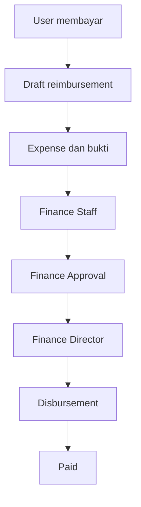
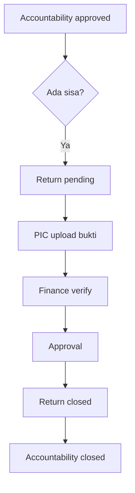

# Phase 7 - Reimbursement dan Pengembalian Sisa Dana

## 7.1 Reimbursement Submission

Reimbursement memakai `financial_submissions` sebagai dokumen workflow dengan `type=reimbursement` dan kategori berkode `reimbursement`. Detail claimant dan snapshot rekening disimpan di `reimbursement_details`.

## 7.2 Expense dan Attachment

Satu reimbursement mendukung banyak transaksi. Setiap transaksi wajib memiliki satu `purchase_proof` dan satu `payment_proof`. File disimpan private dan hanya diunduh melalui route ber-policy. Total klaim dihitung backend dari `actual_amount`.

## 7.3 Finance Review

Queue dan status Finance existing digunakan kembali. `finance_validated_amount` tidak boleh melebihi klaim; catatan wajib jika nominal dikurangi.

## 7.4 Approval dan Director

Workflow Approval dan Director existing digunakan kembali. Nominal Approval dibatasi nominal Finance. Pencairan memakai rekening tujuan snapshot claimant dan rekening sumber perusahaan.

## 7.5 Reimbursement Payment

Saat submission menjadi `fund_disbursed`, detail menyimpan `paid_amount` dan `paid_at`. Pembayaran ganda dicegah oleh constraint disbursement existing.

## 7.6 Accountability Shortfall

Accountability dengan `additional_amount > 0` menjadi `reimbursement_pending`. PIC dapat menghasilkan satu draft reimbursement selisih. Constraint unik mencegah draft ganda. Accountability ditutup otomatis setelah reimbursement dibayar.

## 7.7 Fund Return

Nomor dokumen menggunakan `RET/YYYY/MM/000001`. Nominal berasal dari `remaining_amount` dan tidak dapat diedit. Rekening tujuan wajib berasal dari rekening perusahaan aktif.

## 7.8 Accountability Closing Rule

- Tanpa selisih: langsung `closed` setelah Approval.
- Sisa dana: `return_pending`, lalu `closed` setelah fund return disetujui.
- Kekurangan dana: `reimbursement_pending`, lalu `closed` setelah reimbursement dibayar.

## 7.9 Monitoring

Status Phase 7 tersedia pada queue role, sidebar, audit log, notification center, status history submission, dan perjalanan dana existing.

## 7.10 Security

Policy membatasi data milik claimant/PIC, rekening user divalidasi backend, expected return tidak berasal dari request, attachment private, dan snapshot rekening mencegah perubahan historis.
